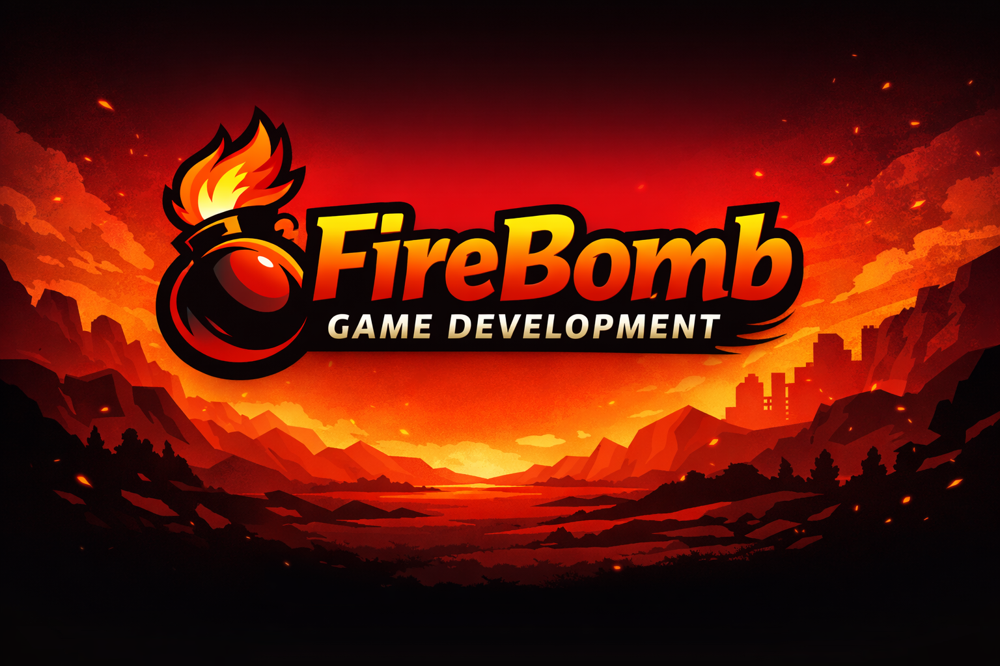

  

<h1 align="center">FireBomb Game Development</h1>

 A collection of Unity game development projects focused on building clean,
scalable gameplay systems with strong architectural foundations.

Emphasis on state machines, modular design, and data-driven flows to create
maintainable, expressive, and performance-aware game code.

  <a href="https://github.com/FireBomb-game-development">Game Dev Repos</a> •
  <a href="https://github.com/sagir567">Developer</a> •
  <a href="https://www.linkedin.com/in/sagiyosefazulay">LinkedIn</a>

---

## Featured Projects

### Frontier Quest 
- Scalable gameplay architecture using state machines and OOP
- Reusable combat, movement, and interaction systems
- Focus on maintainable code and memory-efficient design

### Timeless World 
- Top-down roguelike / speedrun-style prototype
- Time-based core mechanic (time replaces health)
- Gameplay pacing, risk–reward decisions, and progression systems

### Pokémon-Style Prototype 
- Turn-based combat prototyping
- Reusable components and structured gameplay logic

---

## 🔧 Tech & Skills

### Game Development
- Designing and delivering playable Unity game projects
- Implementing complete gameplay loops (movement, combat, progression)
- Translating game design ideas into working systems

### Programming & Architecture
- Strong foundation in C# and Object-Oriented Programming
- Practical use of design patterns in gameplay systems
- Building scalable and modular game architectures
- Writing clean, readable, and maintainable code

### Gameplay Systems
- State machines for player, enemy, and game flow logic
- Reusable systems for combat, movement, and interactions
- Data-driven gameplay using ScriptableObjects
- Clear separation between gameplay logic, data, and presentation

### Performance & Code Quality
- Performance-aware development mindset
- Memory-conscious system design
- Refactoring and improving existing systems over time

### Game Design Understanding
- Core game design principles: pacing, feedback, and risk–reward
- Prototyping mechanics to validate gameplay ideas
- Iterative development focused on playability and feel

### Development Workflow
- Git-based version control
- Clean repository structure and project organization
- Independent project planning and execution

---

## Tech Focus
- Unity (2D)
- Gameplay systems & state machines
- ScriptableObjects & clean architecture
- Performance-aware development
- Git-based workflow

---

📧 Contact: **sagir567@gmail.com**
